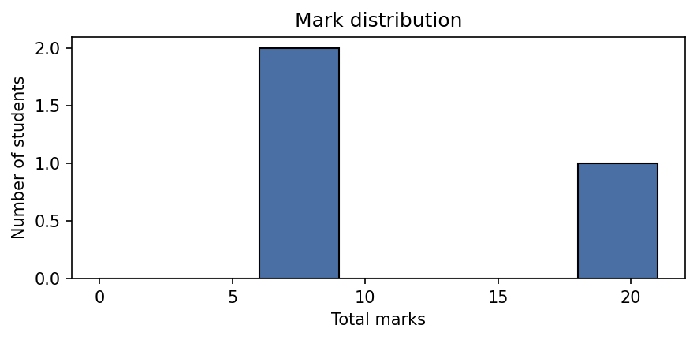
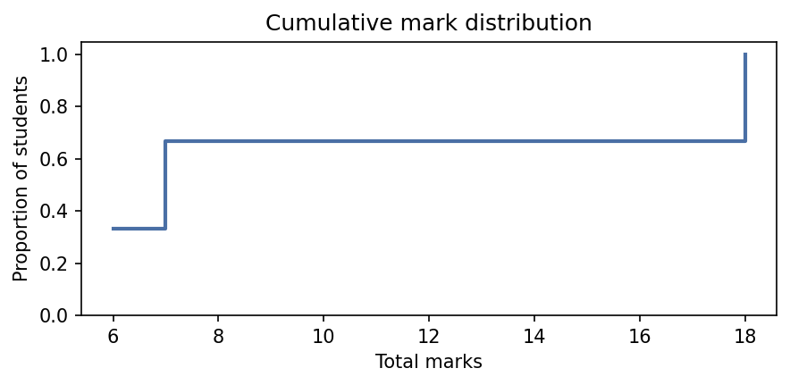
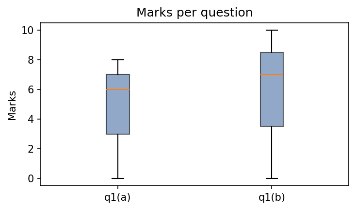
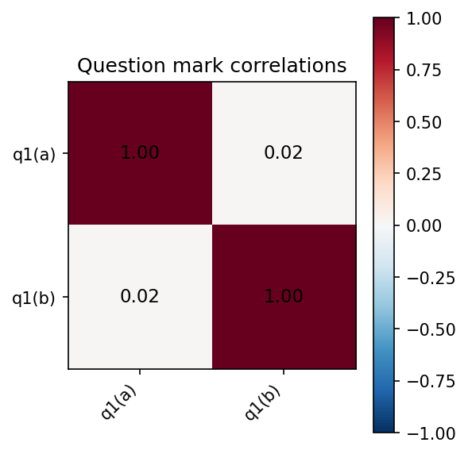

# Getting started

In this tutorial, you will mark a small piece of assessment from
scratch. There are three students and two questions; by the end you will
have individual feedback files, a cohort summary, and a set of
summary charts.

## Install scholia

Assuming you have [uv](https://docs.astral.sh/uv/) installed:
install scholia and its dependencies:

```bash
uv add scholia
```

## Initialise the marking directory

Create the `scholia/` directory and its two starting files:

```bash
uv run scholia init
```

This produces:

```
scholia/
    scheme.yaml
    students.csv
```

`scheme.yaml` is initially empty. `students.csv` contains only the
header row `student_id`.

## Write the marking scheme

Open `scholia/scheme.yaml` and define the questions and categories.
This tutorial uses two questions, each with three possible outcomes:

```yaml
q1(a):
  a:
    marks: 0
    feedback: "Did not attempt the question."
  b:
    marks: 8
    feedback: "Correct and well-presented solution."
  c:
    marks: 6
    feedback: "Correct method but the final calculation contains an error."

q1(b):
  a:
    marks: 0
    feedback: "Did not attempt the question."
  b:
    marks: 10
    feedback: "Correct and well-presented solution."
  c:
    marks: 7
    feedback: "Correct method but missing the boundary case."
```

## Sync the question headers

Run:

```bash
uv run scholia update
```

Scholia reads the question names from `scheme.yaml` and adds the
corresponding columns to `students.csv`, sorted alphabetically:

```csv
student_id,q1(a),q1(b)
```

## Add the students

Open `scholia/students.csv` and append a row for each student,
leaving the category columns blank for now:

```csv
student_id,q1(a),q1(b)
s001,,
s002,,
s003,,
```

## Mark each student

Fill in the category label for each student and question by editing
the CSV directly:

```csv
student_id,q1(a),q1(b)
s001,b,b
s002,c,a
s003,a,c
```

## Generate feedback and summary

Once categories have been assigned for every student and question, run:

```bash
scholia mark
```

Scholia writes:

- `scholia/feedback/s001.md`, `s002.md`, `s003.md`: individual
  feedback files.
- `scholia/marks.csv`: student IDs and total marks.
- `scholia/summary.md`: cohort statistics.
- `scholia/charts/`: summary charts.

## Inspecting the marks CSV

```bash
cat scholia/marks.csv
```

```csv
student_id,total_marks
s001,18
s002,6
s003,7
```

Students who have not been fully marked appear with an empty
`total_marks` cell.

## Inspecting a feedback file

```bash
cat scholia/feedback/s001.md
```

```markdown
# Feedback: s001

**Total marks:** 18

## Question breakdown

### q1(a)

**Marks:** 8

Correct and well-presented solution.

### q1(b)

**Marks:** 10

Correct and well-presented solution.
```

## Inspecting the summary

```bash
cat scholia/summary.md
```

```markdown
# Marking summary

**Students marked:** 3

**Mean:** 10.33

**Median:** 7

**Standard deviation:** 6.66

**Min:** 6

**Max:** 18

## Mark distribution


## Cumulative mark distribution


## Marks per question


## Question mark correlations


## Per-question breakdown

### q1(a)

- Did not attempt the question: 1 student(s) (0 marks)
- Correct and well-presented solution: 1 student(s) (8 marks)
- Correct method but the final calculation contains an error: 1 student(s) (6 marks)

### q1(b)

- Did not attempt the question: 1 student(s) (0 marks)
- Correct and well-presented solution: 1 student(s) (10 marks)
- Correct method but missing the boundary case: 1 student(s) (7 marks)
```

The charts referenced above are saved in `scholia/charts/`. For this
cohort of three students they look like this.

**Mark distribution** (`distribution.png`):



**Cumulative mark distribution** (`cumulative.png`):



**Marks per question** (`boxplot.png`):



**Question mark correlations** (`correlation.png`):



With only three students the correlation is not statistically meaningful,
but with a full cohort it shows whether students who scored well on one
question tended to score well on others.

## Adjusting the scheme

Suppose category `c` in `q1(a)` should be worth 5 marks rather than 6.
Edit `scheme.yaml`:

```yaml
q1(a):
  c:
    marks: 5
    feedback: "Correct method but the final calculation contains an error."
```

Re-run `scholia mark`. All feedback files and the summary are
regenerated automatically from the updated scheme and the unchanged
student assignments. No student record needs editing.

This is the central design of scholia: categories decouple the act of
marking from the numeric mark, so adjustments propagate instantly across
the whole cohort.
