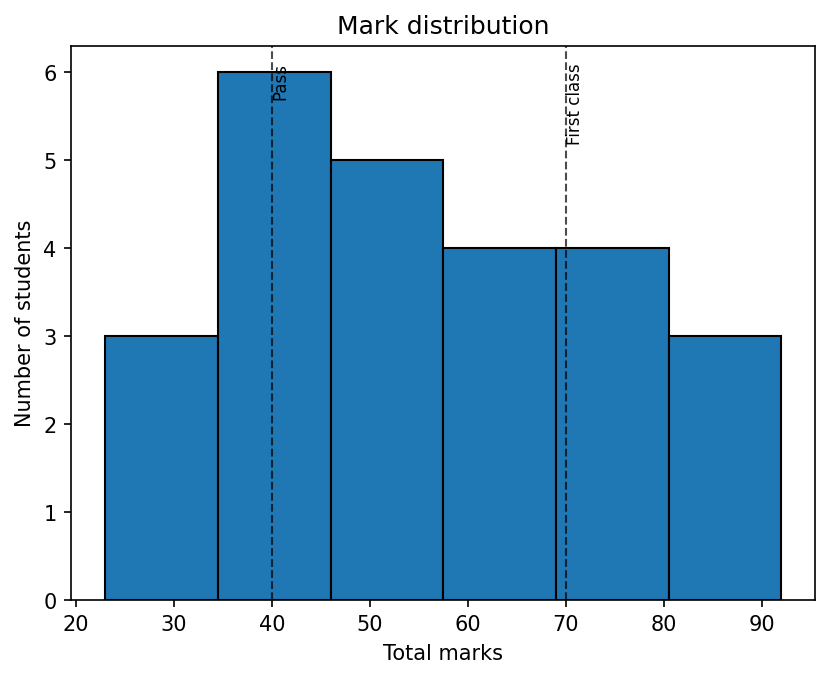
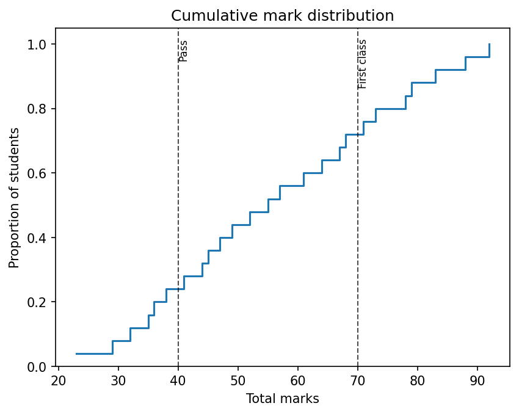

# Getting started

In this tutorial, you will mark a small piece of assessment from
scratch. There are three students and two criteria; by the end you will
have individual feedback files, a cohort summary, and a set of
summary charts.

## Install scholia

Assuming you have [uv](https://docs.astral.sh/uv/) installed:
install scholia and its dependencies:

```bash
uv add scholia
```

## Initialise the marking directory

Create the `scholia/` directory and its two starting files:

```bash
uv run scholia init
```

This produces:

```
scholia/
    scheme.yaml
    students.csv
```

`scheme.yaml` is initially empty. `students.csv` contains only the
header row `student_id`.

## Write the marking scheme

Open `scholia/scheme.yaml` and define the criteria and categories.
This tutorial uses two criteria, each with three possible outcomes:

```yaml
q1(a):
  a:
    marks: 0
    feedback: "Did not attempt the question."
  b:
    marks: 8
    feedback: "Correct and well-presented solution."
  c:
    marks: 6
    feedback: "Correct method but the final calculation contains an error."

q1(b):
  a:
    marks: 0
    feedback: "Did not attempt the question."
  b:
    marks: 10
    feedback: "Correct and well-presented solution."
  c:
    marks: 7
    feedback: "Correct method but missing the boundary case."
```

## Sync the criterion headers

Run:

```bash
uv run scholia update
```

Scholia reads the criterion names from `scheme.yaml` and adds the
corresponding columns to `students.csv`, sorted alphabetically:

```csv
student_id,q1(a),q1(b),note
```

## Add the students

Open `scholia/students.csv` and append a row for each student,
leaving the category columns blank for now:

```csv
student_id,q1(a),q1(b),note
s001,,,
s002,,,
s003,,,
```

## Mark each student

Fill in the category label for each student and criterion by editing
the CSV directly:

```csv
student_id,q1(a),q1(b),note
s001,b,b,
s002,c,a,
s003,a,c,
```

## Generate feedback and summary

Once categories have been assigned for every student and criterion, run:

```bash
scholia mark
```

Scholia writes:

- `scholia/feedback/s001.md`, `s002.md`, `s003.md`: individual
  feedback files.
- `scholia/marks.csv`: student IDs and total marks.
- `scholia/summary.md`: cohort statistics.
- `scholia/assets/`: summary charts.

## Inspecting the marks CSV

```bash
cat scholia/marks.csv
```

```csv
student_id,total_marks
s001,18
s002,6
s003,7
```

Students who have not been fully marked appear with an empty
`total_marks` cell.

## Inspecting a feedback file

```bash
cat scholia/feedback/s001.md
```

```markdown
# Feedback: s001

**Total marks:** 18

## Criterion breakdown

### q1(a)

**Marks:** 8

Correct and well-presented solution.

### q1(b)

**Marks:** 10

Correct and well-presented solution.
```

## Inspecting the summary

```bash
cat scholia/summary.md
```

```markdown
# Marking summary

| Statistic | Value |
| --------- | ----- |
| Count     | 3     |
| Mean      | 10.33 |
| Std dev   | 6.66  |
| Min       | 6     |
| Q1 (25%)  | 6.50  |
| Median    | 7.00  |
| Q3 (75%)  | 12.50 |
| Max       | 18    |

## Mark distribution


## Cumulative mark distribution


## Marks per criterion


## Criterion mark correlations


## Per-criterion breakdown

### q1(a)

- Did not attempt the question: 1 student(s) (0 marks)
- Correct and well-presented solution: 1 student(s) (8 marks)
- Correct method but the final calculation contains an error: 1 student(s) (6 marks)

### q1(b)

- Did not attempt the question: 1 student(s) (0 marks)
- Correct and well-presented solution: 1 student(s) (10 marks)
- Correct method but missing the boundary case: 1 student(s) (7 marks)
```

The charts referenced above are saved in `scholia/assets/`. For this
cohort of three students they look like this.

**Mark distribution** (`distribution.png`):


**Cumulative mark distribution** (`cumulative.png`):


**Marks per criterion** (`boxplot.png`):


**Criterion mark correlations** (`correlation.png`):


With only three students the correlation is not statistically meaningful,
but with a full cohort it shows whether students who scored well on one
criterion tended to score well on others.

## Adding grade bands (optional)

Grade bands are entirely optional. If your institution has grade
boundaries, add a `bands` key to `scheme.yaml` before running
`scholia mark`. Omitting it leaves all output unchanged.

```yaml
bands:
  - name: Fail
    min: 0
  - name: Pass
    min: 40
  - name: First class
    min: 70

q1(a):
  a:
    marks: 0
    feedback: "Did not attempt the question."
  ...
```

Each entry names a band and gives its inclusive lower threshold. With
bands defined, `scholia mark` adds two things to the output.

**Grade-band table in `summary.md`.**  A breakdown of how many
students fall in each band appears after the summary statistics:

```markdown
## Grade bands

| Band        | Range | Students | %     |
| ----------- | ----- | -------- | ----- |
| Fail        | 0–39  | 3        | 15.0% |
| Pass        | 40–69 | 12       | 60.0% |
| First class | ≥ 70  | 5        | 25.0% |
```

**Dashed lines on the distribution and cumulative charts.**  A
vertical dashed line labelled with the band name is drawn at each
threshold, making it easy to see where the cohort sits relative to
the grade boundaries.

**Mark distribution with bands:**



**Cumulative mark distribution with bands:**



## Adjusting the scheme

Suppose category `c` in `q1(a)` should be worth 5 marks rather than 6.
Edit `scheme.yaml`:

```yaml
q1(a):
  c:
    marks: 5
    feedback: "Correct method but the final calculation contains an error."
```

Re-run `scholia mark`. All feedback files and the summary are
regenerated automatically from the updated scheme and the unchanged
student assignments. No student record needs editing.

This is the central design of scholia: categories decouple the act of
marking from the numeric mark, so adjustments propagate instantly across
the whole cohort.
